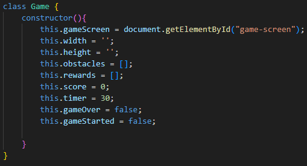
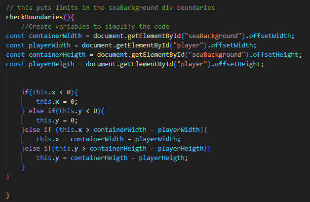
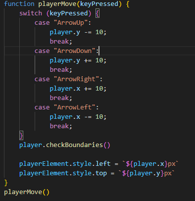
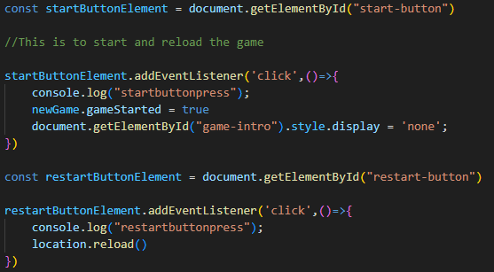
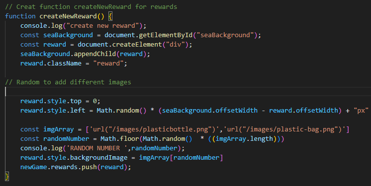
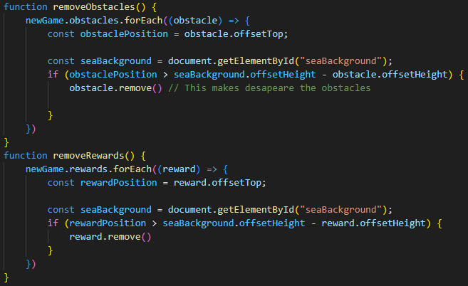
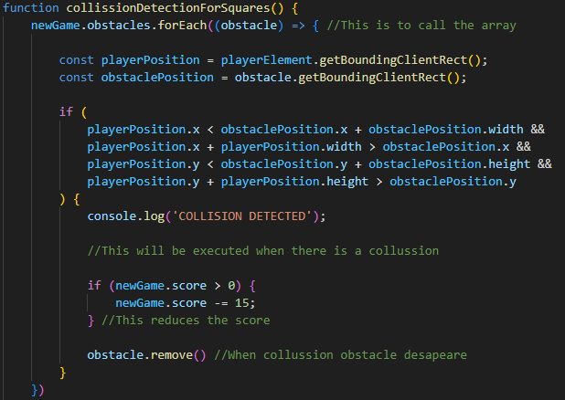

# GAME PROJECT | *SAVING THE PLANET*

## Introduction

As the Module 1 is completed, this project proves that we learnt how to apply the knwoledge in HMTL, CSS and JavaScript.

## The Game

The main goal of this game, once we press *START GAME*, is to reach as many points as possible in 30 seconds.

To achive that, we have to avoid the *yellow fish* who takes out 15 points of our score box and *fishing* the plastic bags and bottle bags as each one earns us 30 points. 

We should take our Greta Thungber player, which could be moved all around the *sea box* in the board.

Once the 30 seconds are passed, the game will be over, but we could restart the game as many time as we pleased.

## The Code

### HTML

Here is where we define our three screens: 

- *game-screen* 
- *game-intro* 
- *game-end*

which will be initially hidden using CSS style display *none*.

Also, we divide our screen board with differents *< divs >*:

### CSS

The look of the game will be defined appliying the style to our classes, ids and elements.

### JS

The JavaScript part will be divide in four files:

- **Game**
- **Player**
- **Obstacle**
- **Script**

1. GAME

Creat the *Game class* and define it's keys.

For example, here is where we set the time of the game:

2. PLAYER

With the *Player class* keys, we also find here the code to limit the boundaries of our *seaBackground* *< div >* using *offsetWidth* and *offsetHeigth* :

We will create new variables to simplify the code and make it more readable. 

3. OBSTACLE

Again, we create a new class to definde the obstacle and we will give arguments to it.

4. SCRIPT

Here is where the magic happens.

First, we need to move our player. To achive that, we create a function which is going to get the *keyPressed* as an argument and move the player accordingly.

The function that we created in the *player* file, will be called here:

To working the START and RESTART button, we will call them by id and we will make them work by the *click method*:

We display the style *none* to make disapeare the screen once we click the button.

The next step is to create our obstacle and rewards using functions. 

As our reward will display two differents images, we use the *random method* to randomly assign them:

We will also have to create function to move and remove this obstacles and rewards to make them desapeare when them reach the bottom of the *seaBackground* *< div >*.

This are our obstacle and rewards:

Talking about collisions, using the *removes()* method, when the position of the player collides with an obstacle or a reward, it will desapeare and rest or sum their point to our score.

Again, we use variable to simplify our code:

To make all this functions work, create a setInterval callback function and call all the funcions inside and everything will work every second:

